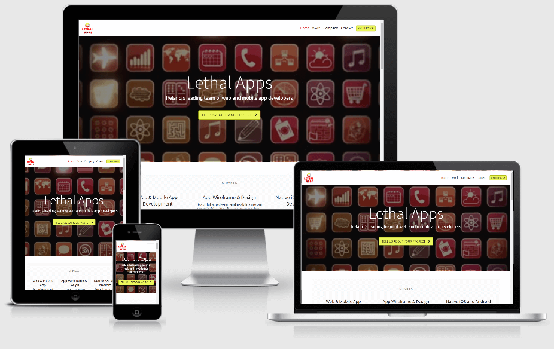
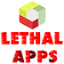

# Lethal Apps

## Overview:

Lethal Apps is a software development services company founded in 2015 with a focus on web and mobile app development.

You can visit the deployed website [here](https://leithdm.github.io/lethalapps/).

 

## Table of Contents
1. [**UX**](#ux)
    - [**User Stories**](#user-stories)
    - [**Design**](#design)
        - [**Framework**](#framework)
        - [**Color Scheme**](#color-scheme)
        - [**Icons**](#icons)
        - [**Typography**](#typography)
    - [**Wireframes**](#wireframes)

2. [**Features**](#features)
    - [**Existing Features**](#existing-features)
    - [**Future Features**](#future-features)

3. [**Technologies Used**](#technologies-used)
    - [**Front-End Technologies**](#front-end-technologies)

4. [**Testing**](#testing)

5. [**Deployment**](#deployment)

6. [**Credits**](#credits)
    - [**Content**](#content)
    - [**Media**](#media)
    - [**Acknowledgments**](#acknowledgments)

 

---

## UX

Lethal Apps is a company founded in 2015 to provide software development services, specifically for web and mobile application development. As company owner, this project was an opportunity to create a website to highlight the services Lethal Apps has to offer, to show-case previously published apps along with open-source portfolio work, and for customers to get in contact with the agency to avail of these services. 

 

### User Stories

- User Stories were written from the perspective of the website owner, a user, and the developer. 
  
 

"**__As an *owner*, I__** ______________________________________________"

- need a  modern, dynamic website to reflect the values of our company.  
- need to ensure customers can use this website to get in Contact.
- need to ensure customers can see a show-case of portfolio work.
- must let the customer know about our past successes via testimonials. 

 

"**__As a *user*, I__** ______________________________________________"

- need to be able to view the site from any device (mobile, tablet, desktop).
- should be presented with a site that meets accessibility guidelines including contrast between background and foreground colors, and non-text elements with alt text equivalents.
- should be presented with a flow of information-layout and interaction-feedback that is clear and unambiguous.
- should have all of my actions confirmed, where appropriate, and feedback should be given at all times.
- should be able to view a show-case of previously completed works by the company.
- should be able to make further enquiries by filling out an enquiry form.
- should be able to see testimonials from other customers that have used the services of this company. 
- should be able to read further details on the company, including info on employees, company vision, etc. 
- my interaction with the site should produce a positive emotional response. I should immediately be drawn-in.

 

"**__As a *developer*, I__** ______________________________________________"

- must maximise future maintainability through documentation, code structure and organisation.
- must document testing fully to include evaluation of bugs found and their fixes and explanation of any bugs that are left unfixed.
- must test and deploy to a cloud platform. HTML/CSS code pass through the official W3C validators with no issues.
- must ensure all HTML attribute and CSS rule names are consistent in format, appropriate and meaningful.

 

### Design

The overall concept is a modern, eye-catching website that show-cases work performed by the agency. The primary goal of the site owner is to make it easy for the customer to get in touch regarding new projects. The site has been designed using a *modern* and *minimalist* concept, with an overall clean, crisp look.

 

#### Framework

- [Boostrap v4.5](https://getbootstrap.com/)
Bootstrap is a free and open-source CSS framework directed at responsive, mobile-first front-end web development. It contains CSS- and (optionally) JavaScript-based design templates for typography, forms, buttons, navigation, and other interface components.

 

#### Color Scheme

- In keeping with the overall *modern* theme, I have opted for a bright color scheme, with plenty of white space. Primary and secondary site colors are inspired from the Lethal Apps Logo i.e. yellow (#ebf65c), red(#df3939), olive-green(#a3ca87) with hints of grey. 

 

 

#### Icons

- The site makes use of [Font Awesome 5.6.1](https://fontawesome.com/) and [Flat Icon](https://www.flaticon.com/).

 

#### Typography

- The site incorporates [Google Fonts](https://fonts.google.com/) throughout the application. The primary font selected is [Source Sans Pro](https://fonts.google.com/specimen/Source+Sans+Pro?query=source+sans+pro) - a good fit for the modern and minimalistic theme.

 

### Wireframes

- Wireframes were created using [Balsamiq Wireframes](https://balsamiq.com/). Note that each 'Header' wireframe contains **both** the mobile and desktop designs.

 

|    Home Page   |    Work.html     |    Company.html    |    Contact.html    |
|    :----:      |    :----:   |    :----:     |    :----:     |
|[Header](wireframes/main-page.png)|[Header](wireframes/work.png)|[Header](wireframes/company.png)|[Header](wireframes/contact.png)|
|[Services](wireframes/services.png)||||
|[Process Part 1](wireframes/process-pt-1.png)||||
|[Process Part 2](wireframes/process-pt-2.png)||||
|[Testimonials](wireframes/quotes.png)||||
|[Footer](wireframes/footer.png)||||

 

##### back to [top](#table-of-contents)

---

## Features

### Existing Features

**The Header** includes:

- **Site Logo**: created using Photoshop, this allows the user to instantly recognise the companies brand. 
- **Navigation Bar**: allows the users to navigate through the site in an easy and intuitive way. Fully responsive, with a burger-bun for smaller devices.
- **'Get In Touch'**: a 'Get in Touch' button that navigates the user to fill out a Contact form. This button is highly visible at all times on the fixed navbar. 

 

**The Footer** includes:

- **Company Name**: allows the user to easily recognise the business’ identity. The footer uses text here to provide contrast to the logo which is visible on the header. 
- **Contact Details**: includes an Email Address that allows users to contact the restaurant if they have any enquiry.
- **Social**: allows users to know more about the restaurant and to read other people’s reviews. These are all dead-links. 

Both the Header and the Footer are consistent throughout the website.

 

**Home Page** includes:

- **Header Video**: eye-catching, and engaging. The user is immediately drawn into the site. This feature had to be carefully implemented as a poorly executed, overly distracting or 'buggy' background video can be a major turn-off for potential customers. Video was replaced with a static image for small-form-factor devices. 
- **Call to action button**: allows a user to instantly 'Tell Us About Your Project' as soon as they arrive at the site. 
- **Services**: allows a user to instantly learn more about the companies Services, in small, easily digestable chunks of information. There is also a 'View Our Work' button to further engage the customer. 
- **Project Management**: allows the user to understand how the company delivers its projects. Shows the user the methodologies employed by the company, and lets them know there is a clear and precise process for delivering their product. 
- **Testimonials**: allows the user to see postive, re-affirming reviews and feedback from previous customers. Illustrates integrity and trustworthiness. 

 

**Work Page** includes:

- **Header Video**: eye-catching, and engaging. The user is drawn further into the page. Video was replaced with a static image for small-form-factor devices. 
- **x4 Portfolio Items**: big, bold, and colourful, these primary portfolio items show-case work performed by the company. Allows the user to see the companies pedigree. 
- **Open Source Portfolio Items**: a chance to show-case open-source projects in a masonry style display. Includes links to 'source code' and 'live views'. Allows the user to see that the company gives back to the community, and has fun in the process. 

 

**Company Page** includes:

- **Header Video**: eye-catching, and engaging. The user is drawn further into the page. Video was replaced with a static image for small-form-factor devices. 
- **Short 'Who we are' story**: allows the user to learn more about the companies philosophy, and history. 
- **Meet the Team**: allows the user to see some of the team members, in a visually appealing way. 

 

**Contact Page** includes:

- **Header Video**: eye-catching, and engaging. The user is drawn further into the page. Video was replaced with a static image for small-form-factor devices. 
- **Contact form**: allows the user to contact the company.
- **Map**: allow the user to know where the company is located.

 

**Favicon**: allows the user to identify the site by just seeing the icon on the tab.

 

### Future Features

- The contact form should POST, and send comfirmation email upon receipt.
- In-depth Case Studies: the x4 main portfolio items on work.html should have individually linked pages detailing wire-frames, user stories, prototypes, etc.  
- Blog section to further promote and advertise the ideas of the company, and developments within the industry. 
- Further detail on 'Meet The Team'.
- Video optimization of header-videos for faster loading. 

##### back to [top](#table-of-contents)

 

---

## Technologies Used

- [VS Code](https://code.visualstudio.com/) - used as the primary IDE.
- [GitHub](https://github.com/) - used for remote storage of code.
- [Photoshop CS6](https://www.adobe.com/Photoshop) - used for creating logo, site images. 
- [TinyPNG](https://tinypng.com/) - used to optimize (.jpg, .png) images for faster loading.

### Front-End Technologies

- [HTML5](https://en.wikipedia.org/wiki/HTML5) - used to provide content and structure.
- [CSS3](https://en.wikipedia.org/wiki/Cascading_Style_Sheets) - used to provide styling.
- [Bootstrap](https://getbootstrap.com/) - used to create the layout of the project.
- [Balsamiq](https://balsamiq.com/) - used to create the project's wireframes.
- [Google Fonts](https://fonts.google.com/) - used to provide font styling.
- [Font Awesome](https://fontawesome.com/) - used to provide icons. 
- [Flaticon](https://www.flaticon.com/) - used to provide icons. 
- [Logo Makr](https://logomakr.com/) - used to make icons for open source section.
- [Am I Responsive?](http://ami.responsivedesign.is/) - used to show site responsiveness. 

 

---

## Testing

The testing process can be viewed [here](TESTING.md).

 

---

## Deployment

**To deploy the project:**

This project is hosted in GitHub Pages

1. On the menu on the top of the project’s repository on GitHub select **Settings**.
2. Scroll down to the GitHub **Pages** section.
3. Inside that section, click on the drop-down menu under **Source** and select **Master Branch**.
4. The page refreshes automatically and the website is now deployed.
5. The link to the webpage is just in the GitHub **Pages** section down below.

Only the master branch has been used for this project.

 

**To run the project locally:**

To clone this project from GitHub:

1. Under the repository’s name, click **Clone or download**.
2. In the **Clone with hTTPS** section, copy the given URL.
3. In your IDE of choice, open **Git Bash**.
4. Change the current working directory to the location where you want the cloned directory to be made.
5. Type **git clone**, and then paste the URL copied from GitHub.
6. Press **enter** and a localized clone will be created.

---

## Credits

### Content

- All of the text in this site was created by myself. Any resemblance to other website content is coincidental. 

- I made use of the following Boostrap components, all of which were modified: 
   - [Collapsible navbar](https://getbootstrap.com/docs/4.0/components/navbar/) 
   - [Cards](https://getbootstrap.com/docs/4.5/components/card/)
   - [Carousel](https://getbootstrap.com/docs/4.5/components/carousel/)
 
 

### Media

- The pictures used in this site were obtained from [Unsplash](https://unsplash.com/). Credit goes to the following photographers: [Annie Spratt](https://unsplash.com/@anniespratt), [Airfocus](https://unsplash.com/@airfocus), [Mimi Thian](https://unsplash.com/@mimithian)

- Header videos were obtained from [Shutterstock](https://www.shutterstock.com/video).

 
